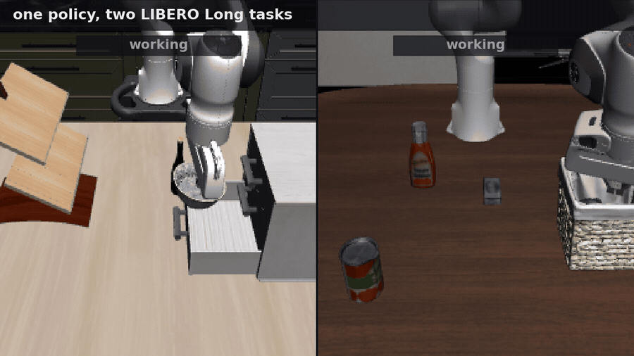

# smolvla_flow_rl



Two LIBERO Long episodes from the author's own runs, side by side. It is footage, not a measurement: two
episodes, chosen, with no repetition and no statistics behind either panel.

Full video: https://www.linkedin.com/posts/mehmetturanyardimci_robotics-reinforcementlearning-vla-ugcPost-7488179589240799232-7Gv6/

Online reinforcement learning fine tuning for a flow matching vision language action policy, on a single
consumer GPU.

A flow matching policy produces an action chunk by integrating a learned velocity field from noise. Integrating
it deterministically gives no action likelihood, so there is nothing for a policy gradient to act on. This
repository takes the standard route around that, following the approach of pi_RL (see `CITATION.cff`): one step
of the integration is treated as stochastic, so the sampled chunk has a tractable log probability. Around that it
builds the machinery such a run needs in order to be trustworthy rather than merely runnable.

No results are reported here. Every number in this repository describes the machinery, what it trains, what it
weighs and how long it takes, and none describes how well it works. The clip above is two episodes of footage
and is not evidence of anything, whatever either panel appears to show. Measurements made with this substrate
will be released with the accompanying paper.

## What is in it

- A stochastic sampler for flow matching policies that leaves the pretrained action head bit identical, driving
  it through a callback rather than modifying it.
- A policy gradient update that grades the action the environment actually executed, over the executed part of
  the chunk only, with the likelihood ratio and its spread recorded once per update cycle, from the last update
  of that cycle.
- A critic head with adaptive target rescaling, kept outside the action head.
- A parameter manifest and a learning rate proof printed before the first update, so what is training and at what
  rate is a logged fact rather than an assumption.
- A process isolated simulator harness with a sparse terminal reward and no shaping.
- A deterministic evaluation entry point that reads several horizons out of one run, with a completeness gate
  that refuses to produce a number from an unfinished evaluation.
- A verification protocol whose rules are written down, with the subset that can be checked mechanically wired
  into a single gate entry point.

## Scope

This is the engineering substrate. It stands on its own as a starting point for anyone doing reinforcement
learning fine tuning of a flow matching policy on limited hardware.

## Why some of this looks paranoid

Several parts of this repository exist because the corresponding mistake was made and cost real time. They are
kept because the failures share a shape: the run keeps going, the loss goes down, and nothing reports an error.

- The likelihood is summed over the executed surface only. Summing over the padded chunk inflates the variance of
  the log ratio, pushes most samples outside the clip range, and throttles the gradient into a slow random walk.
- The update grades stored trajectories. Drawing a fresh chunk at update time and pairing it with a stored
  advantage gives a zero mean gradient, whose signature is a likelihood ratio pinned at one.
- The parameter manifest is printed before training. A run that opened a surface other than the one intended still
  reports a loss, because whatever is trainable moves, and the manifest is the only place the difference shows.
- The evaluation completeness gate counts episodes. Checking that every task appeared at least once is satisfied
  almost immediately and will happily produce a number from a fraction of the intended episodes.
- The checkpoint stores the random state. Without it a resumed run draws a different sequence than an
  uninterrupted one and is no longer reproducible from its seed.

## Hardware

Developed and tested on a single RTX 5070 Ti laptop GPU (12GB VRAM), under WSL2. Anything with 12GB or more
should behave the same; less is untested.

## Getting started

Linux, with a CUDA card and an EGL capable driver. EGL is the simulator's headless path, and the two run
wrappers select it. The evaluation entry point is invoked directly rather than through a wrapper, so it inherits
whatever the shell already has; export `MUJOCO_GL=egl` and `PYOPENGL_PLATFORM=egl` when scoring a checkpoint
outside a training run.

Install the dependencies, fetch the pretrained policy, then run the single task contact test before anything
else. The contact test answers whether the setup can learn at all, which is worth establishing before reading
anything into what a run produces.

```
pip install -r requirements.txt
python -c "import libero.libero"          # answer the prompt once, see below
python scripts/download_base_policy.py --out /path/to/base
bash examples/single_task_contact.sh /path/to/base
```

The middle line is there because the simulator package asks an interactive question the first time it is
imported, before this repository gets a say, and writes the answer to `~/.libero/config.yaml`. Under a shell
with no terminal attached, which is what `nohup`, `cron` and most continuous integration give it, the question
cannot be answered and the import dies with an `EOFError` naming neither this repository nor the cause. Run it
once by hand and the rest is unattended. Keep a network available for the first run beyond fetching the policy.
A source checkout of the simulator carries its assets in the package; a wheel may not, in which case the first
environment built fetches them. Which of those applies to the distribution declared here was not established on
the machine this was developed on, where the source checkout is what is installed.

The policy must be one conditioned on this task suite. The harness supplies two camera images under particular
keys, an eight dimensional state, and expects seven dimensional actions; a checkpoint declaring anything else
cannot be driven by it. The generic SmolVLA base checkpoint is such a case, so the helper does not default to it.
Passing a checkpoint that does not fit stops the run at construction with a message naming the mismatch, rather
than failing later inside a simulator worker.

Fourteen arguments are required. Nine of them describe the run: the task list, the two paths, the number of
update cycles, the rollout length, the episode length, the number of integration steps, the seed, and which part
of the policy trains. The other five are tuning knobs: the exploration noise scale, the discount, the trace decay
and the two learning rates.

None of the fourteen has a default, and the reason is the same in both groups. A default silently becomes a
project wide constant that nobody chose and everybody inherits. The trainable surface is in that list for the
same reason and not as an oversight: opening a surface other than the one intended produces a run whose arguments
look right and whose manifest is the only place the difference shows.

```
python src/train_flow_rl.py --help
```

To score a checkpoint on its own, outside a training run, use the evaluation entry point. It refuses to print a
rate until the completeness gate passes, then reads the same evaluation at every budget asked for.

```
python src/eval_cli.py --help
```

## Verification

The mechanical checks run from one entry point.

```
bash scripts/run_gates.sh
```

That entry point runs three: a syntax and artefact check over the tree, an import closure walk that fails if any
entry point reaches a module this repository does not contain, and the invariant tests. The protocol contains
further rules that are stated but not automated here; each is marked in the document with how far it is taken.
See `protocol/VERIFICATION_PROTOCOL.md` for what each rule is and why it exists.

## Licence and attribution

Apache License 2.0, see `LICENSE`. Four files are derivative works of RLinf: the sampler, the critic head, the
update, and the action model wrapper. Two of those, the sampler and the wrapper, additionally follow LeRobot's own
policy implementation, so they have two upstreams each. All four carry notices of modification in their headers.
See `NOTICE` and `CHANGES_FROM_UPSTREAM.md`. LeRobot is therefore both a dependency and an upstream. No LIBERO
code is adapted here, though its scenes and objects are what the clip at the top renders; `NOTICE` covers that.
No source file from any of them is redistributed here.

No model weights are distributed. The download helper fetches two repositories from the Hugging Face Hub: the
policy, `HuggingFaceVLA/smolvla_libero`, and the backbone that policy asks for, which it reads out of the
policy's own configuration rather than assuming. Both state the Apache License 2.0 on their model cards at the
revisions recorded in `NOTICE`.

Those terms are theirs and not this repository's. If you point `--repo` somewhere else, the helper fetches
whatever backbone that policy asks for and says nothing about the terms of either, because it cannot know them.

If you use this, please cite it and the upstream work, see `CITATION.cff`.
